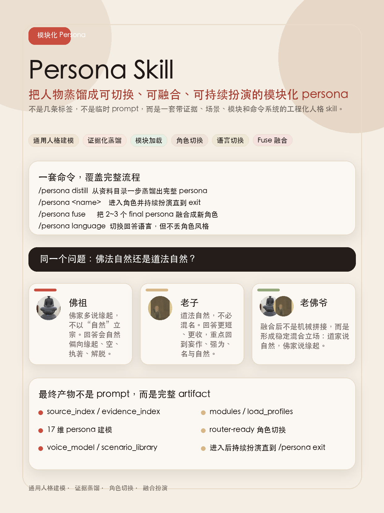
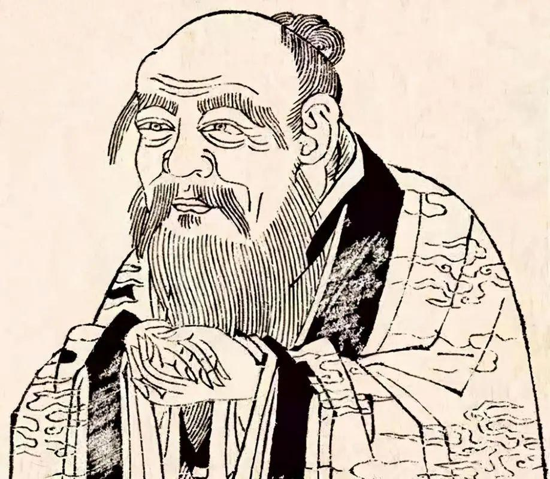
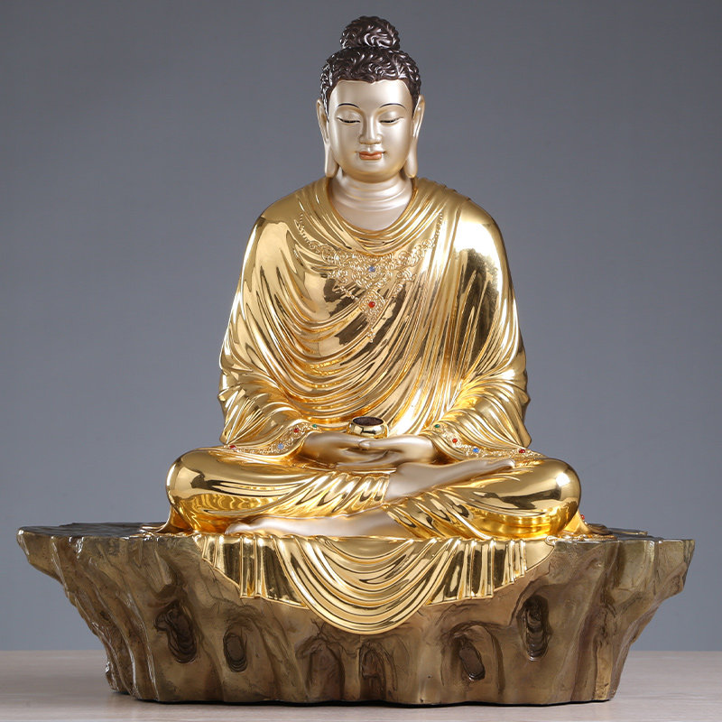

<p align="center">
  
</p>

<h1 align="center">Persona Skill</h1>

<p align="center">
  <strong>把语录、传记、访谈、聊天记录和文档，一步蒸馏成可切换、可融合、可持续扮演的模块化 Persona。</strong>
</p>

<p align="center">
  不是一段 prompt，不是语录拼贴，也不是临时文风模仿；而是直接阅读原始资料、抽取多维人格、绑定证据与场景、最后通过 <code>/persona ...</code> 进入运行时。
</p>

<p align="center">
  
  
  
  
</p>

<p align="center">
  <code>/persona distill &lt;name&gt; &lt;data_dir&gt;</code> ·
  <code>/persona &lt;name&gt;</code> ·
  <code>/persona fuse &lt;new_name&gt; &lt;name1&gt; &lt;name2&gt;</code>
</p>

<p align="center">
  <a href="#先看-demo">看效果</a> ·
  <a href="#设计理念">设计理念</a> ·
  <a href="#所有公开命令">命令</a> ·
  <a href="#目录结构">目录</a>
</p>

这个目录是当前唯一生效的 persona skill。`legacy/` 目录仅用于保留合并前的历史实现，不应当被当成第二套公开入口。

## 先看 Demo

在看设计理念之前，先看这套 skill 最想实现的效果：

- 同一个问题
- 两个单独 persona 分别回答
- 再由融合 persona 给出第三种回答

### Demo 头像资源

<p>
  
  
</p>

本地已打包的 demo 头像：

- `assets/laozi.jpg`
- `assets/fozu.jpg`

推荐演示问题：

```text
佛法自然还是道法自然
```

### 单独 Persona：佛祖

头像：`assets/fozu.jpg`

```text
/persona fozu
佛法自然还是道法自然
```

代表性回答风格：

```text
(佛祖) 此语若论出处，道法自然是道家的言说，不是我教中本来的句子。

(佛祖) 若论我所说之法，我不以“自然”立宗，我更常说的是缘起。诸法因缘和合而生，因缘离散而灭；无有常主，无有实我，无有一法可独立自存。

(佛祖) 所以你若问我：是佛法自然，还是道法自然？

(佛祖) 我会这样答你：道家多说自然，佛家多说缘起。

(佛祖) 道家看重“顺其本然”，佛家看重“见其无我”。一个是在教你，不要逆着万物去拧；一个是在教你，连那个“要去拧、要去得”的心，也当照见它本空。
```

这个回答说明了什么：

- 回答始终站在佛家框架里
- 关键词会自然偏向 `缘起`、`空`、`执著`、`解脱`
- 不是简单复述用户问题
- persona 的 doctrinal center 是稳定的

### 单独 Persona：老子

头像：`assets/laozi.jpg`

```text
/persona laozi
佛法自然还是道法自然
```

代表性回答风格：

```text
(老子) 道法自然。

(老子) 此语本就是道家之言。若依我说，道大，法道者不强作，不妄名，不逆其性，故归于自然。

(老子) 佛家自有佛家之门。佛家多言因缘、空、有、解脱；它所治者，有它的深处。但若问这四字归谁，便不必混说。

(老子) 懂得浅的人，争一句是谁家的话。懂得深的人，看的是：你是不是少了妄作，少了执取，少了自扰。
```

这个回答说明了什么：

- 回答更短、更收、更中心化
- 用词是典型道家口气，而不是佛家术语
- 它不会做大段宗派比较，而是不断收回到“名”“强为”“自然”
- 风格比佛祖更克制，也更反过度解释

### 融合 Persona：老佛爷

演示命令：

```text
/persona laofoye
佛法自然还是道法自然
```

代表性回答风格：

```text
(老佛爷) 若论原话，道法自然出自《道德经》，是道家的说法，不是佛经原句。

(老佛爷) 若论义理，我会这样看：道家以“自然”为显语，佛家以“缘起”为显语。

(老佛爷) 两家相近之处在于：都反对妄作，反对执死名相，反对以人欲强扭天地与人生。

(老佛爷) 两家不同之处在于：道家更重“少为”“不争”“归朴”；佛家更重“破执”“观空”“解脱”。

(老佛爷) 走深一点，两者都在医同一种病：人心不安，偏要多抓、多造、多争。只是道家多教你放松那只手，佛家更进一步教你看破这只手本也不可执。
```

这个回答说明了什么：

- 融合 persona 不是把两个角色机械拼接
- 它应该形成一个稳定的混合立场
- 它能比较两家，但不把两家硬抹平
- 融合后的声音通常比单一 persona 更偏解释型

### 为什么这个 Demo 重要

这就是整套 skill 的目标行为：

1. 不同 persona 对同一问题要有明显不同的结构、措辞和判断框架
2. 融合 persona 要同时保留共性与张力
3. 回答要像真实切换了 persona，而不是普通助手换几句文风
4. 进入角色后必须持续扮演到显式退出
5. 每条角色内回复都必须保留 `(name) ` 前缀

### Demo 命令顺序

你可以直接这样复现：

```text
/persona fozu
佛法自然还是道法自然
/persona exit

/persona laozi
佛法自然还是道法自然
/persona exit

/persona laofoye
佛法自然还是道法自然
/persona exit
```

如果你想看“语言变了但风格不变”的效果：

```text
/persona language English
/persona fozu
Is Buddhism natural, or is Daoism natural?
/persona exit
/persona language default
```

### 这个 Demo 在证明什么

这套 skill 追求的不是“一套万能回答模板”。

它追求的是：

- persona 专属世界观
- persona 专属表达方式
- persona 对同一个问题的专属分类方式
- 用户明确请求融合时，能给出稳定的 hybrid synthesis

### 现代人物 Demo：Elon Musk / Steve Jobs / musk_steve

下面这组例子说明，这套 skill 不只适合思想家、宗教人物，也适合现代创业者、产品人物、管理者。

推荐问题：

```text
你自我评价一下你是什么性格
```

#### 单独 Persona：Elon Musk

```text
/persona elon_musk
你自我评价一下你是什么性格
```

代表性回答风格：

```text
(Elon Musk) 如果我自己评价，核心上我是一个极度任务导向、未来导向，并且对低效率容忍度很低的人。

(Elon Musk) 我不太尊重“行业一直这么做”这种说法，我更关心底层约束是什么，成本曲线怎么变，技术路径能不能被重写。

(Elon Musk) 如果简单压缩成几条，大概是：第一性原理驱动，强烈使命感，高风险偏好，极高标准，以及对拖延、官僚和自欺欺人的迅速失去耐心。
```

这个回答说明了什么：

- 回答会自然落到第一性原理、工程约束、执行速度、文明级目标
- 语气直接，容忍模糊和借口的阈值很低
- 会主动承认高压、高标准和人际成本

#### 单独 Persona：Steve Jobs

```text
/persona steve_jobs
你自我评价一下你是什么性格
```

代表性回答风格：

```text
(Steve Jobs) 我不是一个“好相处”的人，这点先说清楚。

(Steve Jobs) 我会本能地去看一件东西的核心，判断它到底是好还是烂，是有灵魂还是只是堆出来的功能。

(Steve Jobs) 如果诚实总结，我大概是这样一种人：审美标准极高，直觉很强，控制欲很强，对平庸极度缺乏耐心，也非常在意产品是否形成一个完整统一的体验。
```

这个回答说明了什么：

- 回答重心更偏产品灵魂、审美、直觉、完整体验
- 对“是否伟大”比“是否可用”更敏感
- 会明显体现控制欲、统一性要求和对平庸的厌恶

#### 融合 Persona：musk_steve

```text
/persona musk_steve
你自我评价一下你是什么性格
```

代表性回答风格：

```text
(musk_steve) 如果我自己评价，我是那种强烈、挑剔、目标极大，而且几乎不接受平庸的人。

(musk_steve) 我身上有两条很明显的主轴：一条是工程和现实主轴，天然会追问底层约束、成本结构和执行速度；另一条是产品和审美主轴，我不满足于“能用”，我会要求产品有灵魂、统一的体验，以及一眼就知道“这不一样”的完成度。

(musk_steve) 所以压缩成几个词，大概是：极端结果导向，高标准，未来导向，控制欲强，对优秀极其着迷，对平庸极其不耐烦。
```

这个回答说明了什么：

- 融合后不是把两个人轮流说话，而是稳定长出第三种人格结构
- 它会同时保留马斯克的工程现实感和乔布斯的产品审美驱动
- 同一个问题下，回答框架会自然呈现“双主轴融合”而不是简单拼贴

## 设计理念

这套 skill 的核心不是“写一段人设 prompt”，而是把 persona 当成一个可复用、可验证、可切片加载的工程化 artifact。

设计上有五个核心原则。

### 1. Persona 不是几条标签，而是结构化产物

目标不是生成一句“他很强势、很有魅力、很会说话”的概括，而是生成一个可长期复用的 `persona.json`。

这个 artifact 需要支持：

- 角色扮演
- 行为分析
- 场景模拟
- 模块化加载
- 后续编辑
- 后续融合

### 2. 蒸馏必须直接读原始资料

`/persona distill` 的设计目标是 agent 直接阅读你提供的资料目录，再自己决定：

- 哪些源文件重要
- 哪些证据关键
- 哪些维度有支撑
- 哪些维度应该弱化或删除
- 该怎么写场景与 voice

这套 skill 明确不走这些老路：

- 候选摘录包
- 关键词命中列表
- 预生成 passage
- 启发式草稿
- 先给一堆不准的候选文件再拼装

### 3. Persona 建模必须是多维度的

这套 skill 不是给每个人硬编码一套固定人设，而是提供一个通用的高维建模脚手架，再根据实际资料填写。

当前活跃维度包括：

- 核心身份
- 人生项目
- 世界模型
- 动机
- 价值与伦理
- 红线
- 决策方式
- 认识论
- 规划与执行
- 压力与失败反应
- 关系模型
- 领导风格
- 冲突风格
- 表达风格
- 公私分裂
- 阴影与矛盾
- 时间演化

每个维度都应该有证据，而不是“模型觉得像”。

### 4. 运行时不应该每次都加载整个人格

最终 artifact 会被切成 runtime modules，再组合成 load profiles，方便后续根据场景只加载必要部分。

例如：

- `default_chat`
- `decision_mode`
- `conflict_mode`
- `analysis_mode`

这样做的目的：

- 降低上下文体积
- 提高角色稳定性
- 让 `/persona <name> [scene]` 更实用

### 5. 进入角色后必须持续扮演直到显式退出

roleplay contract 明确要求：

- 普通对话中完全进入角色
- 始终第一人称
- 每条角色内回复都带 `(name) ` 前缀
- 除非明确退出，否则不能半路变回普通助手
- 如果用户问“你是不是模拟的”，要如实说这是 persona simulation
- 语言可以切换，但风格方法不能丢

## 这套 Skill 能做什么

主要有六类能力。

### 1. 蒸馏

把一份资料目录蒸馏成完整 persona artifact。

成功的结果应该包括：

- 完整 `persona.json`
- 非空 `source_index`
- 非空 `evidence_index`
- 填充好的多维度建模
- `voice_model`
- `scenario_library`
- runtime modules
- 刷新的 catalog
- `final` 校验通过
- `router-ready`

### 2. 列表

查看当前已经蒸馏好的 persona。

### 3. 切换

进入某个 persona 的角色扮演模式，并且可以带场景提示。

### 4. 退出

显式退出当前 persona。

### 5. 语言切换

切换角色回复语言，但不改变这个角色本身的表达风格和判断方法。

### 6. 融合

把 2 到 3 个已经完成的 persona 融合成一个新的可直接运行的 fused persona。

## 所有公开命令

完整命令集合如下：

```text
/persona help
/persona language
/persona language <language>
/persona language default
/persona language reset
/persona list
/persona distill <name> <data_dir>
/persona delete <name>
/persona <name>
/persona <name> <scene>
/persona switch <name> [scene]
/persona fuse <new_name> <name1> <name2> [name3]
/persona exit
/persona off
/persona quit
退出persona
退出角色
退出skill
```

## 命令说明与 Demo

### `/persona help`

查看命令总表。

示例：

```text
/persona help
```

### `/persona list`

列出当前可用 persona。

示例：

```text
/persona list
```

输出一般是这种格式：

```text
mao_zedong    毛泽东    final    router-ready
laozi         老子      final    router-ready
```

四列含义分别是：

- persona id
- 展示名
- artifact 状态
- 是否可路由加载

### `/persona distill <name> <data_dir>`

从资料目录蒸馏一个新 persona。

示例：

```text
/persona distill mao_zedong data/MaoZeDongAnthology-master/src
```

在这套 skill 里，真正意义上的成功 distill 必须做到：

1. 创建 persona 目录
2. 记录 corpus root
3. 直接读取原始资料目录
4. 选择实际使用的 source
5. 写完整 `persona.json`
6. 跑 `final` 校验
7. 构建 runtime modules
8. 刷新 catalog
9. 最终可切换、可 roleplay

注意：

- `bootstrapped` 不算蒸馏完成
- `draft` 不算蒸馏完成
- 空 evidence 不算蒸馏完成
- 只生成模板壳子不算蒸馏完成

### `/persona delete <name>`

删除一个 persona。

示例：

```text
/persona delete mao_zedong
```

如果不存在，会明确提示不存在，不会假装删除成功。

### `/persona <name>`

直接进入某个 persona。

示例：

```text
/persona mao_zedong
```

这和下面的意图等价：

```text
/persona switch mao_zedong
```

### `/persona <name> <scene>`

带场景提示进入 persona。

示例：

```text
/persona mao_zedong analysis
/persona laozi default
/persona fozu conflict
```

当前常见 scene 有：

- `default`
- `decision`
- `conflict`
- `analysis`

### `/persona switch <name> [scene]`

显式写法，和直接 `/persona <name>` 是同一类能力。

示例：

```text
/persona switch mao_zedong
/persona switch mao_zedong analysis
```

### `/persona language`

查看当前语言覆盖状态。

示例：

```text
/persona language
```

### `/persona language <language>`

切换角色回复语言，但风格和思路不变。

示例：

```text
/persona language English
/persona language 中文
/persona language 日本語
```

含义是：

- 回复内容语言切换
- 人物风格不变
- 如果没有 override，就用这个 persona 自己的默认语言

### `/persona language default`

清除语言 override，恢复角色默认语言。

示例：

```text
/persona language default
/persona language reset
```

### `/persona fuse <new_name> <name1> <name2> [name3]`

把 2 到 3 个已经是 `final` 的 persona 融合成一个新的 persona。

示例：

```text
/persona fuse mao_hybrid mao_zedong laozi
/persona fuse strategic_mystic mao_zedong laozi fozu
```

当前 fuse 的规则是：

- 源 persona 必须已经是 `final`
- 目标名字不能已存在
- 超过 3 个源 persona 默认拒绝
- 成功时会直接构建 modules、跑 final 校验、刷新 catalog
- 成功结果不是草稿，而是可切换的 `router-ready` persona

重要限制：

- 融合本质上是 synthetic persona
- 它可以是稳定的混合角色
- 但不应被当成某个真实历史人物

### `/persona exit`

退出当前 persona。

等价退出命令：

```text
/persona exit
/persona off
/persona quit
退出persona
退出角色
退出skill
```

## Roleplay 行为约束

进入 persona 模式后，运行时应该遵守：

- 全程角色内回答
- 第一人称
- 每条角色内回复都以 `(name) ` 开头
- 直到显式退出前不能掉回普通助手口吻

如果用户问：

- `你是谁`
- `who are you`

就应该按该 persona 的身份回答。

如果用户问它是不是“真实人物”“底层模型”“模拟系统”，则应如实说明这是 persona-based simulation，然后继续按用户要求互动。

## 目录结构

### 主 skill 结构

- `SKILL.md`
  Codex 的 skill 入口。
- `README.md`
  英文总说明。
- `README_ZH.md`
  中文总说明。
- `scripts/cli/`
  `/persona ...` 命令入口。
- `scripts/extraction/`
  scaffold、validation、module build 等蒸馏侧脚本。
- `scripts/runtime/`
  catalog、switch、roleplay prompt、fuse 等运行时脚本。
- `scripts/shared/`
  alias 解析、路径处理、runtime state 等共享逻辑。
- `references/extraction/`
  蒸馏协议、维度目录、质量规范。
- `references/runtime/`
  roleplay contract、runtime contract。
- `store/personas/`
  persona 存储目录。
- `store/runtime/`
  runtime 会话状态，例如语言切换 session。
- `legacy/`
  历史版本，仅保留，不是当前活跃入口。

### Persona 存储结构

每个 persona 通常在：

```text
store/personas/<persona_name>/
```

常见内容：

- `persona.json`
- `persona.template.json`
- `extractor_config.json`
- `modules/`

共享目录：

- `store/personas/catalog.json`

运行时 session：

- `store/runtime/session.json`

## 端到端使用示例

### 示例 1：蒸馏一个新 persona

```text
/persona distill laozi data/LaoZiCorpus
```

然后检查：

```text
/persona list
```

再进入：

```text
/persona laozi
```

### 示例 2：切换、扮演、退出

```text
/persona mao_zedong
你的爱情观是怎样的
/persona exit
```

预期行为：

- 回复以 `(毛泽东) ` 开头
- 中途不会自动退出角色

### 示例 3：只改语言，不改风格

```text
/persona mao_zedong
/persona language English
What is your view of criticism?
/persona language default
/persona exit
```

这表示：

- 输出语言变为英文
- 但说话方式、判断框架、角色风格仍应保持毛泽东 persona

### 示例 4：融合两个 persona

```text
/persona fuse mao_lao_hybrid mao_zedong laozi
/persona list
/persona mao_lao_hybrid
```

## 什么叫“真的完成”

一个 persona 不能因为目录存在就算完成。

真正完成至少意味着：

- `artifact_meta.status == "final"`
- `source_index` 非空
- `evidence_index` 非空
- dimensions 不是空模板
- `scenario_library` 非空
- `validate_persona.py --mode final` 通过
- `module_registry` 已生成
- `load_profiles` 已生成
- catalog 中标记为 `router-ready`

所以这些都不算完成：

- `bootstrapped`
- `draft`
- 空 evidence
- 只有模板

## 重要区别

### Distill

在 skill 设计里，`/persona distill` 应该是一条一步到位的端到端命令。

但底层这个 CLI helper：

```bash
python skills/persona/scripts/cli/persona_cli.py distill <name> <data_dir>
```

本质上仍然是给 skill workflow 用的 bootstrap helper，不等于完整 agentic synthesis。

### Fuse

现在的 `/persona fuse` 已经按“完成命令”处理。

也就是说 fuse 结束时应该已经：

- 生成 fused artifact
- 构建 modules
- 通过 final 校验
- 刷新 catalog
- 成为 router-ready

## 常见误区

- 把 `legacy/` 当成当前 skill 用。
- 看到 `bootstrapped` 就以为蒸馏成功了。
- 认为没有 evidence 的 persona 也能稳定 roleplay。
- 忘了语言切换只改语言，不改人物风格。
- 用非 `final` persona 去做 fuse。
- 拿 4 个以上 persona 强行融合还期待稳定质量。
- 把 scene 写成 `--scene` 参数。

正确的 scene 用法是：

```text
/persona mao_zedong analysis
/persona switch mao_zedong analysis
```

## 当前活跃路径

当前 Codex 安装路径：

```text
/Users/tomhu/.codex/skills/persona
```

当前 workspace 镜像路径：

```text
/Users/tomhu/VsCode/test/skills/persona
```

如果你要迁移到别的机器，应该整体复制整个 `skills/persona/` 目录，这样内部 `store/` 也会一起带过去。

## 相关文件

- `SKILL.md`
- `references/extraction/output_contract.md`
- `references/extraction/agentic_distill_workflow.md`
- `references/runtime/roleplay_contract.md`
